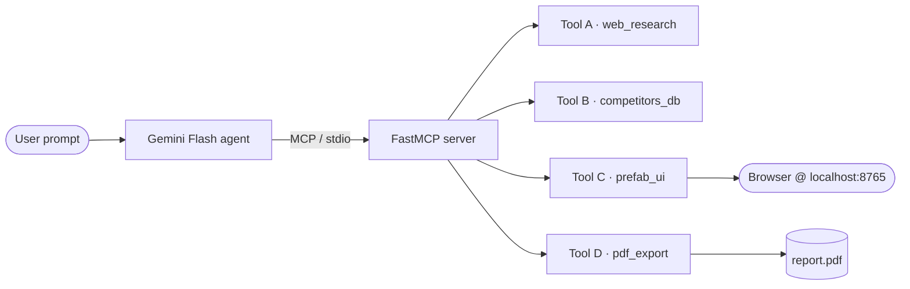

# Competitor Analysis Agent

A generic agent that, given any product, researches its competitors on the
public web, persists structured profiles to a local JSON store, and renders
a live comparison dashboard via [Prefab UI](https://prefab.prefect.io/).
Built around a custom **MCP server** with four tools and driven by a
**Gemini Flash** function-calling loop.

The flagship demo is **Tile Vision AI** — but the agent has zero hardcoded
references to it; swap the prompt and it analyzes any product.

## Demo video

https://youtu.be/5eVxv6zfzvc

## Architecture



Detail in [docs/ARCHITECTURE.md](docs/ARCHITECTURE.md).

## Contents

- [Setup](#setup) · [Run](#run) · [CLI flags](#cli-flags)
- [Common workflows](#common-workflows) — different product, incremental tweaks, tuning N, feature-focused search
- [Saving / exporting the dashboard](#saving--exporting-the-dashboard) — HTML, PDF, timestamped archive
- [MCP tools reference](#mcp-tools-reference) — all 10 tools with signatures + direct Python usage
- [Demo prompt](#demo-prompt) · [Logs](#logs) · [Scoring justification](#scoring-justification)

## Setup

Requires Python 3.11+ and [`uv`](https://github.com/astral-sh/uv) (recommended)
or pip.

```bash
cd SS4/competitor-analysis-agent
uv sync                              # or: pip install -e .
cp .env.example .env
```

Fill in `.env`:

| Var | Required | Notes |
|---|---|---|
| `GEMINI_API_KEY` | yes | https://aistudio.google.com/apikey |
| `TAVILY_API_KEY` | optional | https://tavily.com — falls back to DuckDuckGo if absent |
| `AGENT_MODEL` | optional | Defaults to `gemini-2.5-flash`. Use `gemini-2.5-pro` if Flash skips tool use. |
| `PREFAB_PORT` | optional | Default `8765`. Live server binds `127.0.0.1`. |
| `AGENT_MAX_STEPS` | optional | Default `30`. Auto-scales with `-n` so larger searches don't hit the cap. |

## Run

```bash
uv run competitor-agent              # runs the Tile Vision AI demo prompt
uv run competitor-agent "Analyze competitors for Linear in the project-tracking space."
```

The agent prints a Rich-formatted trace of every model thought, tool call,
and tool result. When it finishes, it has:

- written 5+ records to [data/competitors.json](data/competitors.json),
- spun up `prefab serve` at the URL printed by `render_dashboard`, and
- (optionally) saved a PDF to [data/report.pdf](data/report.pdf).

Open the dashboard URL in a browser to see the live UI.

### Run pieces individually

```bash
# MCP server only (for poking with the MCP Inspector or your own client)
uv run competitor-mcp

# Prefab dashboard only (after a run has populated dashboard_state.json)
uv run prefab serve dashboard_app/dashboard.py
uv run prefab export dashboard_app/dashboard.py -o data/dashboard.html
```

## CLI flags

```text
competitor-agent [PROMPT]
  --product-name STR        Name of the product
  --product-url URL         Product website
  --product-description STR One-line description
  --category STR            Product category
  -n, --max-competitors N   Target profiles (1-50, default 5)
  --mode {live,static}      Dashboard render mode
  --clear                   Wipe the database before this run
  --keep                    Keep existing competitors (additive run)
  --max-steps N             Override agent step budget (auto-scales otherwise)
```

## Common workflows

### Analyze a different product (by URL)

```bash
uv run competitor-agent \
  --product-name "Linear" \
  --product-url "https://linear.app" \
  --category "project tracker for engineering teams"
```

### Analyze by description only (no URL)

```bash
uv run competitor-agent \
  --product-name "FieldFlow" \
  --product-description "AI scheduling for HVAC field-service crews" \
  --category "field service management software"
```

### Add ONE more competitor on top of the existing dashboard

```bash
uv run competitor-agent --keep \
  "Add Houzz to the existing competitors database for Tile Vision AI. Fetch their site, save the profile, then call update_dashboard_section to refresh the cards and table without re-rendering everything."
```

### Tweak just the positioning analysis (no new research)

```bash
uv run competitor-agent --keep \
  "Re-read the current competitors with read_competitors, then call update_dashboard_section('positioning', ...) with a sharper market-positioning analysis. Don't search or fetch anything."
```

### Tune the number of competitors (5 → 50)

```bash
uv run competitor-agent -n 10              # 10 profiles, ~25 steps
uv run competitor-agent -n 25              # 25 profiles, ~55 steps auto-budgeted
uv run competitor-agent -n 50 --clear      # full sweep, fresh DB
```

`--max-competitors` (`-n`) caps at 50. The agent step budget auto-scales to
`5 + 2N` so deep runs don't hit `AGENT_MAX_STEPS`. Override with `--max-steps`
if you want a hard cap.

### Static export for screenshots / sharing

```bash
uv run competitor-agent --keep --mode static \
  "Re-render the dashboard from the current database state as a standalone HTML file."
# → data/dashboard.html
```

### Fresh run on the default Tile Vision AI prompt

```bash
uv run competitor-agent --clear
```

### Feature-focused search (narrow criteria)

```bash
uv run competitor-agent --clear -n 15 \
"FEATURE-FOCUSED SEARCH — find up to 15 competitors that explicitly offer AUTOMATED 360° VIRTUAL TOUR GENERATION FROM A SINGLE 2D ROOM PHOTO, applied to tiles / flooring / wallpaper / interior surfaces. Reject companies whose website doesn't actually demonstrate the feature."
```

Use this pattern for any narrow capability search — drop the criteria into the
prompt and the agent rejects false positives instead of padding the list.

## Saving / exporting the dashboard

The dashboard reads `data/dashboard_state.json`, which the MCP tools keep in
sync with `data/competitors.json`. Three save formats:

### A. Standalone HTML (sharing / archiving)

```bash
uv run prefab export dashboard_app/dashboard.py -o data/dashboard.html
open data/dashboard.html
```

Single self-contained file (~50–60 KB). No server, opens in any browser.

### B. PDF report (stakeholder-ready)

Via the agent:
```bash
uv run competitor-agent --keep \
"Call export_dashboard_pdf to render data/report.pdf and tell me the absolute path."
```

Or directly without spinning up Gemini:
```bash
PYTHONPATH=. .venv/bin/python -c \
"from mcp_server.tools.pdf_export import export_dashboard_pdf; print(export_dashboard_pdf())"
open data/report.pdf
```

### C. Timestamped archive (HTML + PDF in one go)

```bash
TS=$(date +%Y%m%d-%H%M%S)
uv run prefab export dashboard_app/dashboard.py -o data/dashboard-$TS.html
PYTHONPATH=. .venv/bin/python -c \
"from mcp_server.tools.pdf_export import export_dashboard_pdf; export_dashboard_pdf('data/report-'+'$TS'+'.pdf')"
ls -lh data/dashboard-$TS.html data/report-$TS.pdf
```

Useful when you want to keep the output of every demo run.

## Demo prompt

The exact prompt baked into the runner — also in [demo/demo_prompt.md](demo/demo_prompt.md):

> I'm building Tile Vision AI (https://swayam01.github.io/tile-vision-website/),
> an AI room/tile visualizer for homeowners, designers, and tile retailers.
> Find at least 5 real competitors, research each one's pricing, features,
> strengths, and weaknesses, save complete profiles to the local competitors
> database, and render a comparison dashboard I can review.

This single prompt forces the agent to chain all three required tool families
plus the bonus PDF export.

## Use this for any product

The agent has no hardcoded knowledge of Tile Vision AI. Two ways to swap product:

**Free-form prompt:**
```bash
uv run competitor-agent "Analyze competitors for Notion in the workspace category."
uv run competitor-agent "Find alternatives to Stripe Atlas for LLC formation, save profiles, and render the dashboard."
```

**Structured flags (recommended for repeat runs):**
```bash
uv run competitor-agent \
  --product-name "Notion" \
  --product-url "https://notion.so" \
  --category "team workspace and notes" \
  -n 8
```

See [Common workflows](#common-workflows) above for the full menu.

## MCP tools reference

The MCP server exposes 10 tools across 4 families. The agent calls them via
function-calling; you can also call them directly from Python (examples below).

### Tool A — `web_research`

| Tool | Signature | What it does |
|---|---|---|
| `search_competitors` | `(product_name, product_description, category, max_results=10)` | Multi-query search via Tavily (preferred) → DuckDuckGo fallback. Returns `[{name, url, snippet, source}]`. |
| `fetch_competitor_page` | `(url, force_refresh=False)` | httpx + BeautifulSoup. SHA-256 disk cache at `data/cache/`. Returns `{url, title, cleaned_text, pricing_hints[], feature_mentions[], cached}`. |

### Tool B — `competitors_db` (CRUD on `data/competitors.json`, file-locked)

| Tool | Signature | What it does |
|---|---|---|
| `create_competitor` | `(record: CompetitorRecord)` | Insert. Errors on duplicate name (case-insensitive). |
| `read_competitors` | `(filter: dict \| None = None)` | List all, or substring-filter on string fields. |
| `update_competitor` | `(name, updates: dict)` | Patch fields; refreshes `last_updated`. |
| `delete_competitor` | `(name)` | Remove by name. Returns bool. |
| `clear_database` | `()` | Wipe all. Returns count cleared. |

`CompetitorRecord` shape: `{name, website, description, pricing, features[], strengths[], weaknesses[], target_market, headquarters, last_updated}`.

### Tool C — `prefab_ui`

| Tool | Signature | What it does |
|---|---|---|
| `render_dashboard` | `(your_product, competitors, analysis=None, mode='live')` | Full render. `mode='live'` spawns `prefab serve`; `mode='static'` runs `prefab export`. |
| `update_dashboard_section` | `(section, content)` | Hot-patch one section. `section` ∈ `{'product', 'table', 'cards', 'positioning'}`. Live UI reloads automatically. |

### Tool D — `pdf_export` (bonus)

| Tool | Signature | What it does |
|---|---|---|
| `export_dashboard_pdf` | `(out_path: str \| None = None)` | ReportLab PDF mirroring the live state. Default `data/report.pdf`. |

### Triggering tools via the agent

The agent decides which tools to call based on your prompt. To force a
specific tool, name it in the prompt:

```bash
# Tool A only
uv run competitor-agent "Use search_competitors with max_results=20 to find tile-visualizer companies. Don't save anything yet, just list the hits."

# Tool B only — no web research
uv run competitor-agent --keep "Call read_competitors with filter={'headquarters': 'India'} and tell me how many you found."

# Tool C only — re-render from existing state
uv run competitor-agent --keep --mode static "Re-render the dashboard from the current database with no new research."

# Tool D only — PDF
uv run competitor-agent --keep "Call export_dashboard_pdf and report the path."
```

### Calling tools directly from Python (skip the agent)

Useful for scripting and tests.

```python
# In SS4/competitor-analysis-agent/, with PYTHONPATH=. and .venv active

from mcp_server.tools import web_research, competitors_db, prefab_ui, pdf_export

# A
hits = web_research.search_competitors(
    product_name="Tile Vision AI",
    product_description="AI room/tile visualizer",
    category="AI room visualizer",
    max_results=10,
)
page = web_research.fetch_competitor_page("https://roomvo.com/")

# B
records = competitors_db.read_competitors()
competitors_db.update_competitor("Roomvo", {"pricing": "Enterprise — contact sales"})

# C
prefab_ui.render_dashboard(
    your_product={"name": "Tile Vision AI", "description": "...", "category": "..."},
    competitors=records,
    analysis={"summary": "...", "differentiators": [], "threats": [], "opportunities": []},
    mode="live",
)
prefab_ui.update_dashboard_section("positioning", {"summary": "Updated take..."})

# D
pdf_path = pdf_export.export_dashboard_pdf("data/report.pdf")
```

### Inspecting the MCP server with the Inspector

For debugging tool schemas / payloads:

```bash
npx @modelcontextprotocol/inspector uv run competitor-mcp
```

Opens the MCP Inspector pointed at our server — you can fire any tool with
arbitrary args and see the raw response.

## Logs

Every tool call is logged to stderr **and** to `logs/agent.log` (rotating, 2 MB).
Tail it during the demo:

```bash
tail -f logs/agent.log
```

## Scoring justification

What's in here that pushes the build past the minimum:

- **4 tools, not 3** — bonus PDF export via ReportLab.
- **Two render modes** — live (`prefab serve`, hot reload) and static
  (`prefab export`, deterministic for screenshots).
- **Caching** — `fetch_competitor_page` results are SHA-256 keyed on disk;
  re-runs are network-free for already-seen pages.
- **Error recovery** — pages that 404 raise with a guidance message; the
  system instruction tells the agent to pick a different source rather than
  retry blindly.
- **Generic by design** — system instruction + agent CLI both accept any
  product; no Tile Vision AI references in the agent code.
- **File-locked JSON store** — concurrent runs don't corrupt the DB.
- **Rich-formatted trace** — every step rendered as a labeled panel for
  YouTube-friendly logs.
- **Provider fallback** — Tavily preferred, DuckDuckGo automatic fallback;
  no key required to demo.
- **Strict typing** — Pydantic schemas everywhere, validated on every
  CRUD write.
