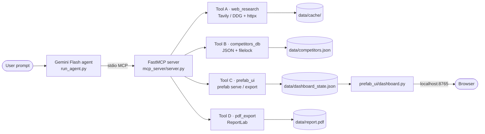

# Architecture

## Components

## Why this shape

- **MCP over stdio** lets the agent and tools live in the same Python process tree.
  No HTTP server to manage; spawning the MCP server *is* the integration.
- **Single state file (`dashboard_state.json`)** decouples Tool C from Prefab's
  internals. The dashboard.py reads state at render time, so partial updates
  (`update_dashboard_section`) are just file writes — `prefab serve` hot-reloads.
- **File-locked JSON store** is enough at this scale and keeps the demo
  reviewable: the YouTube viewer can open `data/competitors.json` and see exactly
  what the agent saved.
- **Cache on disk** keyed by SHA-256 of URL means re-runs of the demo skip
  network for already-fetched pages — useful when iterating on prompts.

## Agent loop

1. Spawn MCP server, list tools, convert each tool's JSON Schema into a Gemini
   `FunctionDeclaration` (stripping `$schema`, `title`, `additionalProperties`
   which Gemini rejects).
2. Send the user prompt + `tools=[FunctionDeclaration...]`.
3. Inspect response parts. If any part has a `function_call`, dispatch via
   `session.call_tool(name, args)` and append a `function_response` part.
4. Loop until the response has only text parts (terminal state) or
   `AGENT_MAX_STEPS` is hit.

## Where things can break

| Surface | Failure mode | Mitigation |
|---|---|---|
| Tavily key missing/invalid | Search returns empty | DDG fallback kicks in automatically |
| Competitor page 404 | `fetch_competitor_page` raises with a hint | Agent picks a different hit per system prompt |
| Gemini Flash skips tools | "no tool calls happened" | Switch `AGENT_MODEL` to `gemini-2.5-pro` in `.env` |
| `prefab` CLI not on PATH | Tool C raises | `uv sync` then `uv run competitor-agent` (uses the venv's PATH) |
| Concurrent agent runs | Race on JSON file | `filelock` serializes writes |
